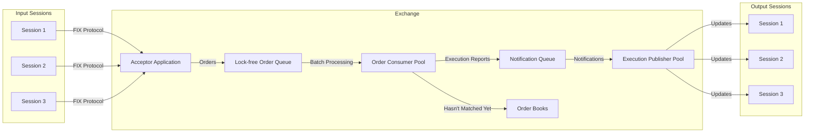

# High-Performance Exchange POC

A multi-threaded exchange system proof of concept that demonstrates modern C++ concurrency patterns and lock-free data structures for order processing.

## Architecture Overview

The system implements a high-throughput order matching engine with the following key components:



## Key Features

- **Multi-threaded Architecture**: Thread pool for parallel order processing
- **Lock-free Data Structures**: Concurrent queues for order processing
- **FIX Protocol Support**: FIX 4.2 protocol implementation
- **Efficient Order Matching**: d-ary heaps for priority queue implementation
- **Batch Processing**: Optimized order and notification processing
- **Market Data Updates**: Real-time market data dissemination

## Technical Implementation

### Core Components

1. **Acceptor Application**

   - FIX protocol client connection handling
   - Session lifecycle management
   - Order routing to processing pipeline

2. **Order Consumer Pool**

   - Parallel order processing
   - Batch processing implementation
   - Matching logic and trade execution

3. **Order Book**

   - Price-time priority matching
   - d-ary heap-based order management
   - Market and limit order handling

4. **Execution Publisher**
   - Client execution report publishing
   - Market data update management
   - Notification batching

## Dependencies

- C++23
- QuickFIX (FIX protocol implementation)
- Boost (system, thread)
- BS Thread Pool
- ConcurrentQueue (lock-free queue implementation)
- Unordered Dense Map (high-performance hash map)
- nlohmann/json (JSON parsing)

## Building the Project

```bash
mkdir build
cd build
cmake ..
make
```

## Project Structure

```
.
├── include/                 # Header files
├── src/                     # Source files
└── CMakeLists.txt         # Build configuration
```

## Further Required Improvements

- Add persistence layer for order book state in an interval based snapshot manner
- Enhance monitoring and metrics collection
- Add signalling mechanism for managing global boolean values for external management
